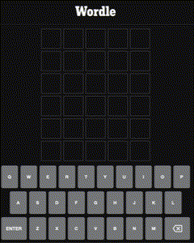

# wordle-bot
Bot for the "Wordle game" from: [Wordle](https://www.powerlanguage.co.uk/wordle/). Opens your browser and solves in front of you.

<center>

 

</center>

### 1. requirements.txt 
- Can be used to install virtual environment dependencies.
- Uses Safari browser (EDIT line 30-31 in main.py for Chrome)

Using pip
```
pip install -r requirements.txt
```

Using Conda
```
conda create --name "ENTER NAME HERE" --file requirements.txt
```

### 2. Run
```
python main.py
```


### References
- Got started with the following tutorial: https://www.signifytechnology.com/blog/2019/10/controlling-the-web-with-python-by-william-koehrsen
- Solved shadow root problem using code snippets from: https://cosmocode.io/how-to-interact-with-shadow-dom-in-selenium/
- Uses Selenium to automate the browser: https://selenium-python.readthedocs.io
